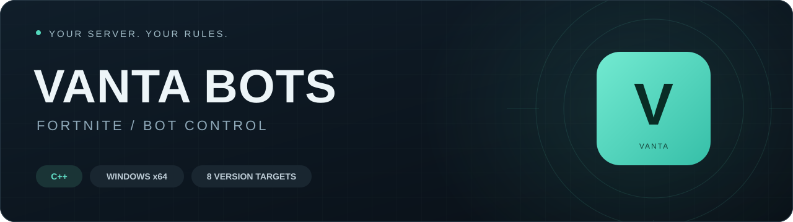
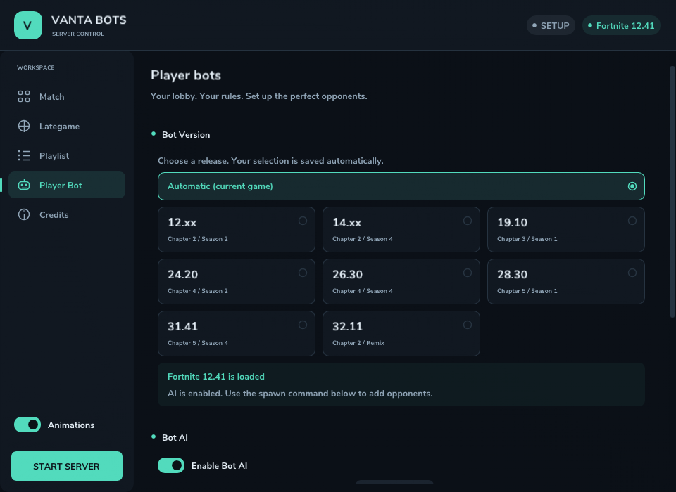

<p align="center">
  
</p>

<h1 align="center">Vanta Bots</h1>

<p align="center">
  A C++ server module for Fortnite.<br>
  Bots, version selection, and match controls in one interface.
</p>

<p align="center">
  <a href="#quick-start">Quick start</a> ·
  <a href="#versions">Versions</a> ·
  <a href="docs/BUILDING.md">Building</a> ·
  <a href="docs/COMPATIBILITY.md">Compatibility</a> ·
  <a href="https://github.com/uytewey-dot/Vanta-bots/issues">Report an issue</a>
</p>

<p align="center">
  <strong>C++</strong> &nbsp; / &nbsp; Windows x64 &nbsp; / &nbsp;
  Visual Studio 2022 &nbsp; / &nbsp; <a href="LICENSE">BSD 3-Clause</a>
</p>

---

Vanta Bots builds on Magnesium, a fork of [Erbium](https://github.com/plooshi/Erbium), a Fortnite gameserver for Chapters 1–5. It adds a server control panel, configurable bots, and version profiles. The build produces **`Magnesium.dll`**.

## Features

| Feature | What it does |
| --- | --- |
| **Bot AI** | Spawn opponents that move, select hostile targets, check line of sight, fire, and reload. |
| **Version selection** | Choose one of eight targets or **Automatic**, with your selection saved across sessions. |
| **Bot settings** | Configure names, health, shields, detection range, and engagement distance. |
| **Interface** | Use version cards, smooth transitions, and animated toggles. Turn motion off with **Animations**. |
| **Match controls** | Choose a playlist, configure the server, and start match preparation with **Start Match**. |
| **Server features** | Configure Late Game, Arena, commands, infinite ammo, and infinite materials. |

<p align="center">
  
  <br>
  <sub>Interface preview using sample Fortnite 12.41 data. This is not a running game session.</sub>
</p>

<a id="quick-start"></a>

## Quick start

1. **Get the DLL:** [build the project](docs/BUILDING.md) or download `Vanta-Bots-Windows-x64` from a successful [GitHub Actions run](https://github.com/uytewey-dot/Vanta-bots/actions/workflows/build.yml).
2. Load `Magnesium.dll` using your existing server loader. The DLL requires **Microsoft Visual C++ 2015–2022 Redistributable x64**.
3. Open **Player Bot → Bot Version**. Select your game version or **Automatic (current game)**.
4. Enable **Enable Bot AI**, configure the bot settings, and start the match.
5. Once your player pawn has spawned, run this command in the game console:

```text
cheat spawnbot 1 scar
```

This creates one bot with the weapon assigned to the `scar` alias. Use `cheat help` to see the other commands.

Bots act during an active match. Ranged weapons from their starting loadout or spawn command receive a full magazine and up to three spare magazines of matching ammo, limited by the ammo stack size. Bots without a ranged weapon do not participate in ranged combat.

**Disabling AI stops weapon fire.** Existing bots remain available as stationary practice targets.

<a id="versions"></a>

## Version selection

| Menu option | Chapter and season | Selection rule |
| --- | --- | --- |
| **12.xx** | Chapter 2 · Season 2 | Releases from 12.00 up to, but excluding, 13.00 |
| **14.xx** | Chapter 2 · Season 4 | Releases from 14.00 up to, but excluding, 15.00 |
| **19.10** | Chapter 3 · Season 1 | Exact release 19.10 |
| **24.20** | Chapter 4 · Season 2 | Exact release 24.20 |
| **26.30** | Chapter 4 · Season 4 | Exact release 26.30 |
| **28.30** | Chapter 5 · Season 1 | Exact shipping build; experimental profile |
| **31.41** | Chapter 5 · Season 4 | Exact shipping build; experimental profile |
| **32.11** | Chapter 2 · Remix | Exact shipping build; experimental profile |

**Automatic** uses the loaded game's version. An explicit selection restricts bot spawning and AI: a version mismatch blocks both. The selection is saved immediately, even when **Auto Host** and **Save Settings** are off.

Selecting a card does not install a different Fortnite version. The 12.xx and 14.xx season options use the existing dynamic SDK path; action parameters have been checked against the **12.41** and **14.60** SDKs.

> **Verification status:** the Windows x64 DLL builds, and regression tests and interface checks have passed. Live game sessions on these versions have not been tested. A menu option does not establish working gameplay on every patch. [Read the compatibility notes →](docs/COMPATIBILITY.md)

## Recent changes

- Added **12.xx** and **14.xx** season options while preserving existing version preferences.
- Added a reload path using the gameplay ability exposed by older SDKs.
- Fixed bot weapons spawning with an empty magazine and no reserve ammo.
- Added handling for inventory and ability-system initialization failures.
- Refreshed the theme, navigation, version cards, and interface animations.

AI does not yet loot, build, or navigate around obstacles. See the [roadmap](docs/ROADMAP.md) for other known issues.

## Building and documentation

Run this command from the repository root in **Developer Command Prompt for VS 2022**:

```bat
msbuild Magnesium.sln /m:2 /p:Configuration=Release /p:Platform=x64
```

Output: `x64/Release/Magnesium.dll`.

| Document | Contents |
| --- | --- |
| [Building and tests](docs/BUILDING.md) | Toolchain setup, DLL builds, GitHub Actions, and regression checks. |
| [Compatibility](docs/COMPATIBILITY.md) | Bot behavior, exact profiles, SDK sources, and verification limits. |
| [Roadmap](docs/ROADMAP.md) | Known issues and previously completed work. |

<a id="report-an-issue"></a>

## Report an issue

Open an issue in this repository. Include your Fortnite version and build, selected profile, bot spawn command, and steps to reproduce the problem. Attach the relevant part of the log.

## Credits and license

The project is based on [Erbium](https://github.com/plooshi/Erbium) by **Ploosh**. Vanta Bots builds on that code and adds server features.

Distributed under the [BSD 3-Clause license](LICENSE). The original copyright notice is preserved.
